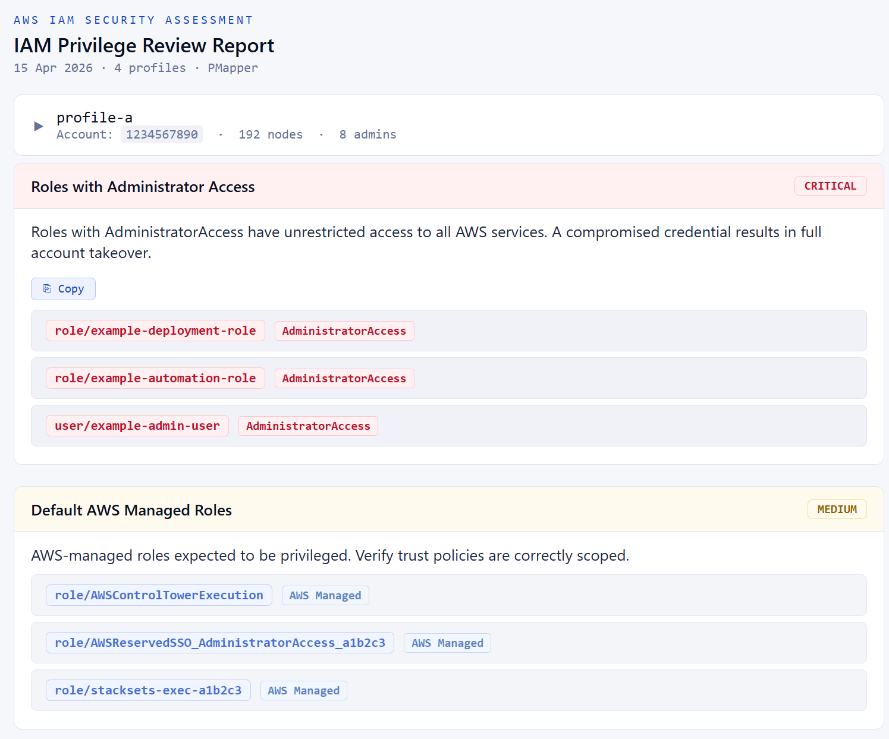
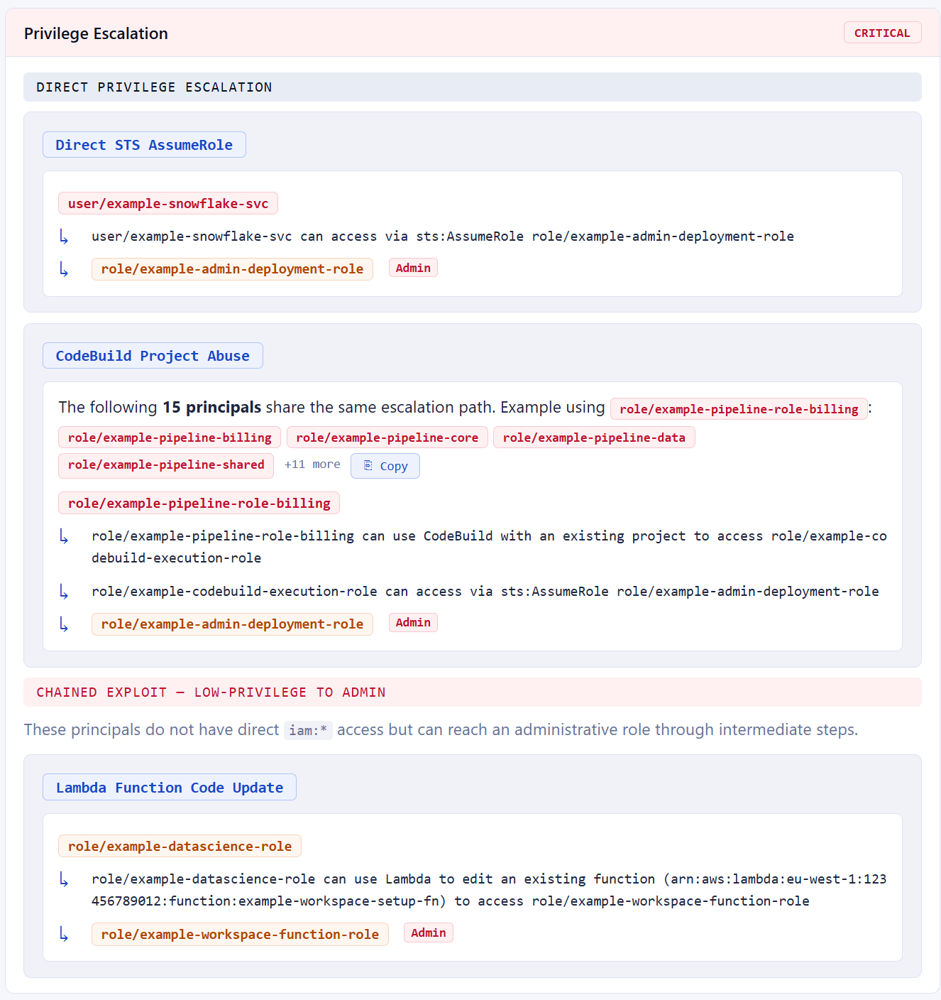
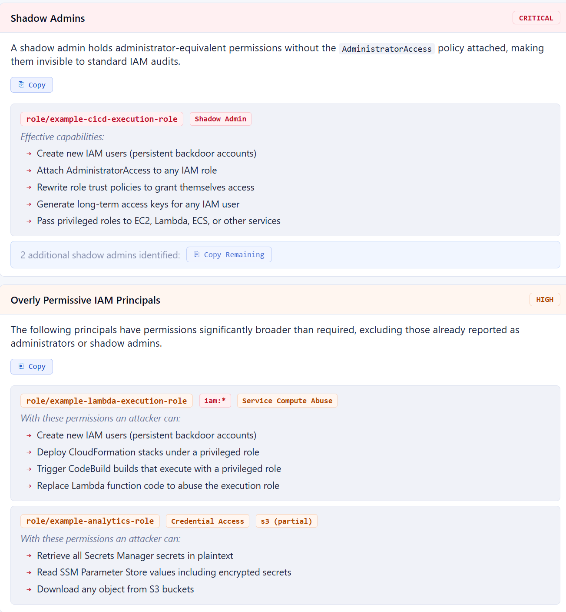

# PrivMapper

> One command. Multiple AWS accounts. Pentest-ready IAM report.

PrivMapper runs PMapper across all your AWS profiles and turns the raw output into a clean HTML report — grouped findings, full escalation chains, zero duplication.





---

## The Problem

PMapper is great at finding escalation paths. But turning its output into a report means manually reading dozens of text files, cross-referencing four accounts, and writing the same path descriptions from scratch every engagement.

PrivMapper solves that.

---

## What You Get

| Finding | What it shows |
|---|---|
| **Roles with Administrator Access** | Confirmed via AWS CLI + PMapper graph |
| **Default AWS Managed Roles** | ControlTower, StackSets, SSO — expected but worth reviewing |
| **Shadow Admins** | Admin-equivalent access without `AdministratorAccess` policy |
| **Overly Permissive Principals** | Sorted by risk, deduplicated, no noise |
| **Privilege Escalation** | Every path grouped by technique with full hop chains |

Multi-hop paths show every step:

```
role/example-pipeline-role
  ↳ can use CodeBuild to access role/example-codebuild-execution-role
  ↳ can assume role/example-admin-deployment-role  [Admin]
```

Multiple principals sharing the same path? Collapsed into one block with a copy button.

---

## Install

```bash
pip install principalmapper
git clone https://github.com/ShubhamDubeyy/privmapper
```

---

## Usage

```bash
python3 pmapper_iam.py hg-dev hg-prod hg-services hg-capital
```

Or set defaults at the top of the script:

```python
DEFAULT_PROFILES = ["hg-dev", "hg-prod", "hg-services", "hg-capital"]
```

Output lands in `pmapper_output_YYYYMMDD_HHMMSS/report.html`. Open in any browser.

---

## Excluding Regions

Opt-in and unreachable regions cause timeout hangs during graph creation. These are excluded by default:

```python
EXCLUDE_REGIONS = "me-south-1 ap-east-1 af-south-1 eu-south-1 me-central-1 ap-southeast-3"
```

Add any additional unreachable regions to this variable at the top of the script.

---

## Output

```
pmapper_output_20260415_143000/
├── report.html
├── hg-dev/
│   ├── 02_graph_stats.txt
│   ├── graph.svg
│   ├── presets/   (privesc, wrongadmin, serviceaccess, endgame)
│   └── queries/   (38 IAM permission checks)
├── hg-prod/
├── hg-services/
└── hg-capital/
```

---

## Requirements

- Python 3
- `pip install principalmapper`
- AWS credentials in `~/.aws/config` for each profile

---

## Disclaimer

For authorised security assessments only.

---

Made with love by [Shubham Dubey](https://www.linkedin.com/in/shubham-dubeyy)

[](https://www.linkedin.com/in/shubham-dubeyy)
[](https://github.com/ShubhamDubeyy)
